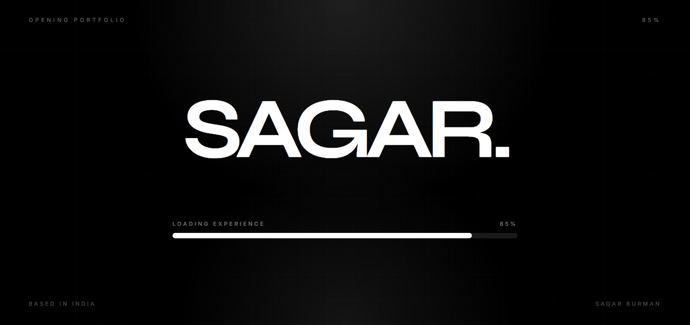
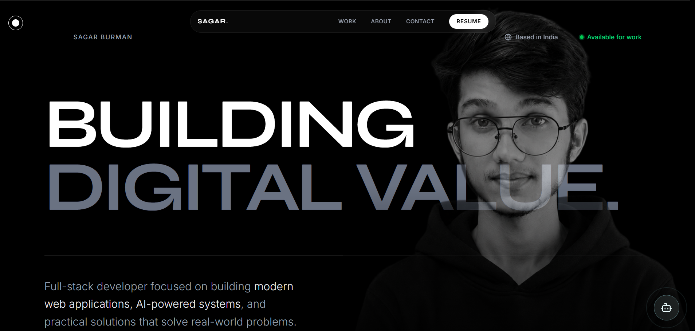

<div align="center">

# ✨ Sagar Burman - Personal Portfolio with AI

A modern, responsive personal portfolio website showcasing my projects, skills, services, and an integrated AI assistant.

[](https://react.dev/)
[](https://vitejs.dev/)
[](https://tailwindcss.com/)
[](https://www.framer.com/motion/)

[Live Demo](https://sagar.vercel.app) • [Report Bug](https://github.com/Sagar-Burman/portfolio/issues) • [Request Feature](https://github.com/Sagar-Burman/portfolio/issues)

</div>

---

## 🎯 Overview

This portfolio features a sleek dark visual style, glassmorphism-inspired UI elements, smooth motion transitions, route-based project detail pages, and a floating AI chat widget. It is built with React 19 and modern frontend tooling for performance and maintainability.

---

## 🖼️ Profile Preview

| Landing Section | Portfolio Layout |
| :---: | :---: |
|  |  |

<div align="center">

### ⚡ Key Highlights

|  |  |  |
| :---: | :---: | :---: |
| 🌙 **Dark Theme** | 🎨 **Glassmorphism UI** | 🖱️ **Custom Cursor** |
| 📱 **Responsive Layout** | ⚡ **Fast Vite Build** | 🎬 **Motion Animations** |
| 🤖 **AI Agent Chat** | 📧 **Formspree Contact Form** | 🧭 **Project Detail Routes** |

</div>

---

## 🚀 Features

- **Modern Portfolio UI** - Clean dark design with animated sections and polished interactions
- **AI Agent Widget** - Floating chatbot with quick command hints and contextual responses
- **Smart Fallback UX** - If AI service is unavailable, bot suggests direct contact paths
- **Project Showcase** - Work cards with detail pages plus a "View All Projects On GitHub" CTA
- **Contact System** - Functional contact form integrated with Formspree
- **Responsive by Default** - Optimized across mobile, tablet, and desktop

---

## 🛠️ Tech Stack

<div align="center">

| Category | Technologies |
| :---: | :--- |
| **Frontend** | React 19, React Router DOM 7 |
| **Styling** | Tailwind CSS 4, Custom CSS, PostCSS |
| **Animations** | Framer Motion 12 |
| **Icons** | Lucide React, React Icons |
| **Build Tool** | Vite 7 |
| **Contact** | Formspree |
| **Linting** | ESLint 9 |

</div>

---

## 📁 Project Structure

```text
portfolio/
├── api/
│   └── chat.js
├── public/
├── src/
│   ├── assets/
│   │   └── screenshot/
│   ├── components/
│   │   ├── BotWidget.jsx
│   │   ├── Contact.jsx
│   │   ├── CredentialsPreview.jsx
│   │   ├── Cursor.jsx
│   │   ├── Footer.jsx
│   │   ├── Hero.jsx
│   │   ├── LoadingScreen.jsx
│   │   ├── Navbar.jsx
│   │   ├── Process.jsx
│   │   ├── Profile.jsx
│   │   ├── ProjectDetails.jsx
│   │   ├── Projects.jsx
│   │   ├── ScrollIndicator.jsx
│   │   ├── Services.jsx
│   │   ├── ServiceUnavailable.jsx
│   │   └── Skills.jsx
│   ├── utils/
│   │   └── portfolioContext.js
│   ├── App.css
│   ├── App.jsx
│   ├── index.css
│   ├── main.jsx
│   ├── personalData.js
│   └── projectsData.js
├── eslint.config.js
├── index.html
├── package.json
├── postcss.config.js
├── README.md
└── vite.config.js
```

---

## ⚡ Quick Start

### Prerequisites

- **Node.js** 18+
- **npm** (or compatible package manager)

### Installation

1. **Clone the repository**

```bash
git clone https://github.com/Sagar-Burman/portfolio.git
cd portfolio
```

2. **Install dependencies**

```bash
npm install
```

3. **Create environment variables**

Create a `.env` file in the project root.

| Provider | Variables |
| :--- | :--- |
| **OpenRouter** | `OPENROUTER_API_KEY`, `OPENROUTER_MODEL`, `OPENROUTER_SITE_URL`, `OPENROUTER_SITE_NAME` |
| **Groq** | `GROQ_API_KEY`, `GROQ_MODEL` |
| **Gemini** | `GEMINI_API_KEY`, `GEMINI_MODEL` |
| **OpenAI** | `OPENAI_API_KEY`, `OPENAI_MODEL` |

Example:

```env
OPENROUTER_API_KEY=your_openrouter_key
OPENROUTER_MODEL=meta-llama/llama-3.1-8b-instruct:free
OPENROUTER_SITE_URL=http://localhost:5173
OPENROUTER_SITE_NAME=Portfolio Chatbot

GROQ_API_KEY=your_groq_key
GROQ_MODEL=llama-3.1-8b-instant

GEMINI_API_KEY=your_gemini_key
GEMINI_MODEL=gemini-3-flash-preview

OPENAI_API_KEY=your_openai_key
OPENAI_MODEL=gpt-4o-mini
```

4. **Run the development server**

```bash
npm run dev
```

5. **Open in browser**

```text
http://localhost:5173
```

---

## 📜 Available Scripts

| Command | Description |
| :--- | :--- |
| `npm run dev` | Start development server with HMR |
| `npm run build` | Build for production |
| `npm run preview` | Preview production build locally |
| `npm run lint` | Run ESLint checks |

---

## 🎨 Customization

### Update Personal Content

- Edit profile and social links in `src/personalData.js`
- Edit project details in `src/projectsData.js`
- Update AI quick hints and fallback reply in `src/components/BotWidget.jsx`
- Refine chat context logic in `src/utils/portfolioContext.js`

### Work Section CTA

The Work section includes a dedicated button that links to GitHub for viewing all projects.

---

## 📱 Main Sections

| Section | Description |
| :--- | :--- |
| **Hero** | Intro banner with role and primary actions |
| **Skills** | Categorized technical and soft skills |
| **Projects (Work)** | Project cards and detail routes with GitHub CTA |
| **Services** | Service offerings and value proposition |
| **Process** | Workflow and approach summary |
| **Credentials** | Education and certificates preview |
| **Contact** | Formspree contact form and direct channels |
| **AI Agent** | Chatbot for portfolio Q&A and guided navigation |

---

## 🤝 Connect With Me

<div align="center">

[](https://linkedin.com/in/sagarburman)
[](https://github.com/Sagar-Burman)
[](https://x.com/sagar_1218)
[](https://www.instagram.com/__.s4garrr/)

</div>

---

## 📄 License

No license file is currently included in this repository.

---

<div align="center">

**⭐ Star this repo if you found it helpful!**

Made with ❤️ by [Sagar Burman](https://github.com/Sagar-Burman)

</div>
